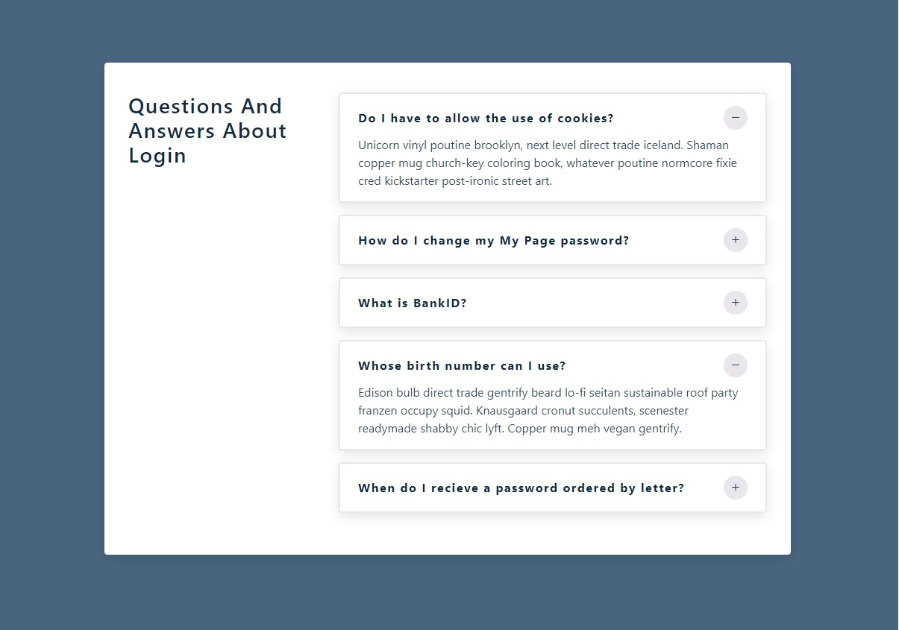

<h1 align="center">
  Q&A
</h1> 

## 💻 Project

 - Learning ReactJS;
 - A simple project to practice ReactJS.
 

&nbsp;&nbsp;

---

## 🔥 Check it out!
 

- [https://questions-and-answers-reactjs-app.netlify.app/](https://questions-and-answers-reactjs-app.netlify.app/)

  

&nbsp;&nbsp;

